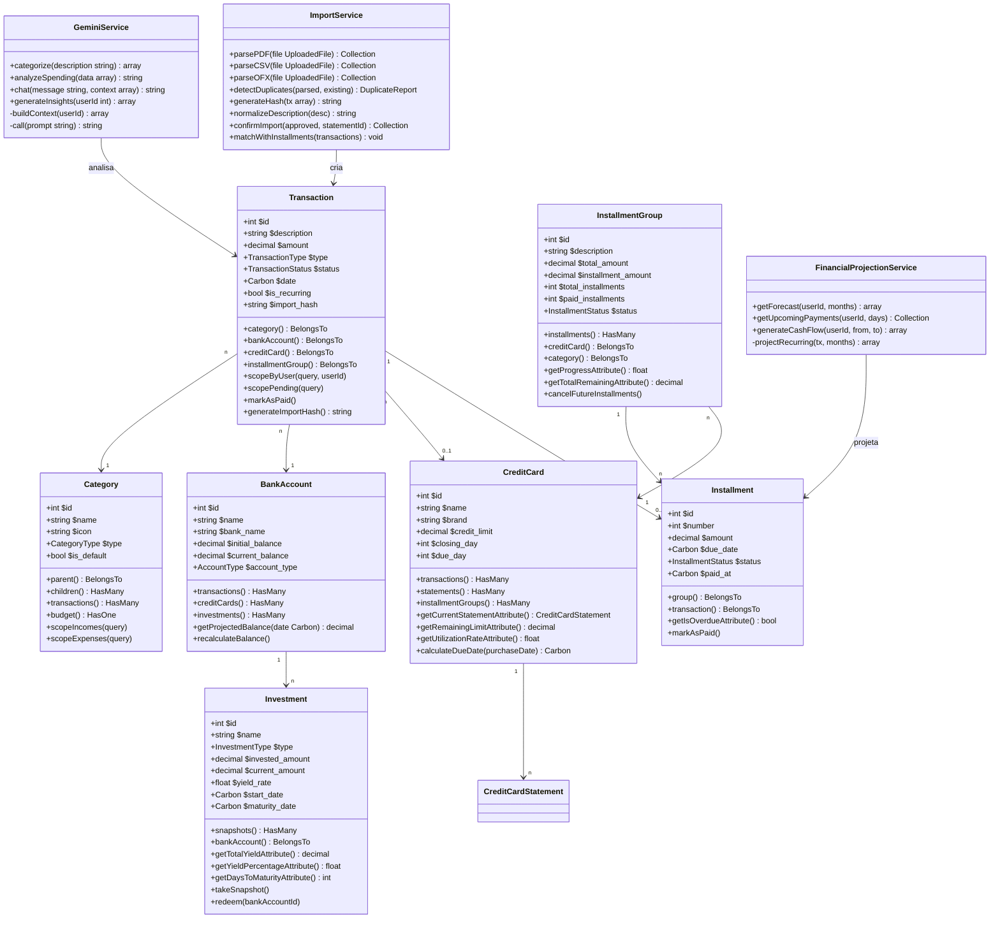
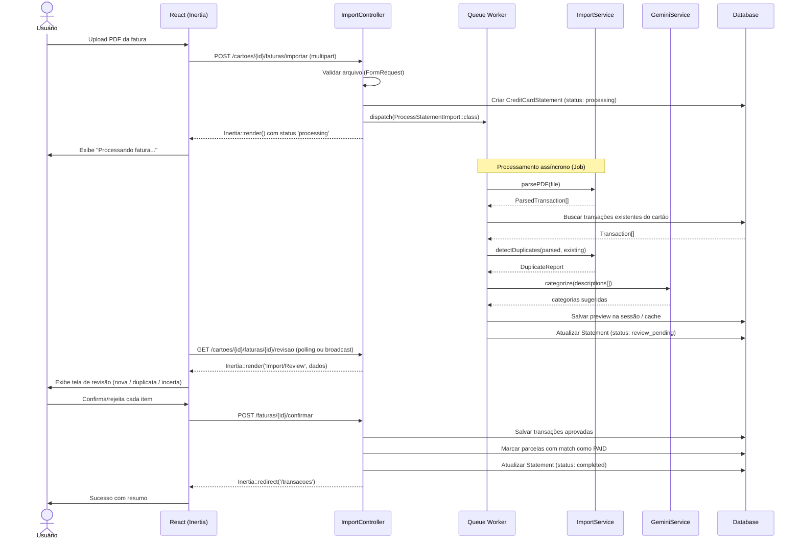
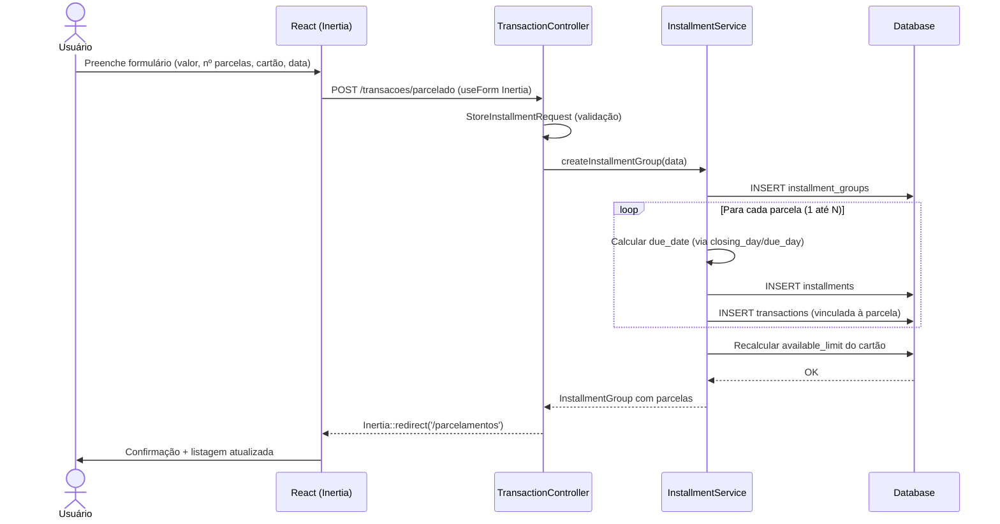
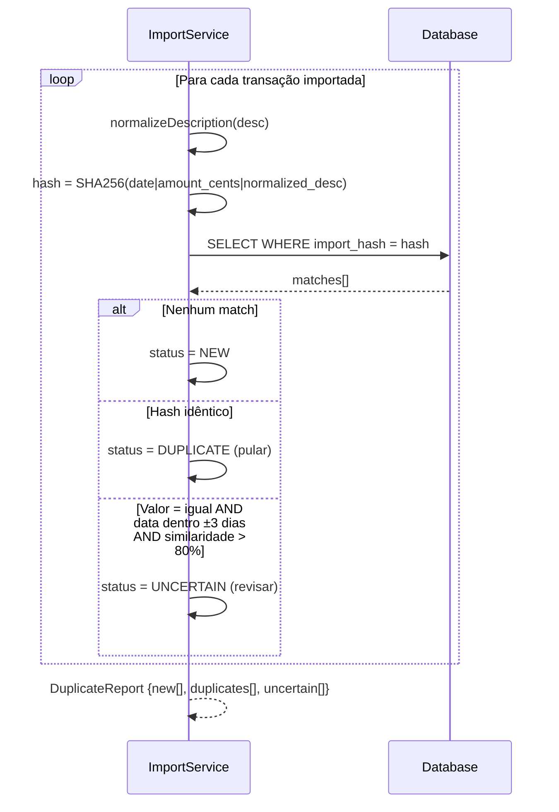

# 💰 Gerenciador Financeiro Pessoal — Plano de Desenvolvimento

> **Versão:** 2.0  
> **Data:** Março 2026  
> **Autor:** Bruno Souza  
> **Objetivo:** Aplicação pessoal para controle financeiro com previsibilidade, gestão de parcelas, faturas de cartão, investimentos e análise inteligente via IA.

---

## 📋 Índice

1. [Visão Geral do Produto](#1-visão-geral-do-produto)
2. [Stack Tecnológica](#2-stack-tecnológica)
3. [Arquitetura do Sistema](#3-arquitetura-do-sistema)
4. [Modelo de Dados — ERD](#4-modelo-de-dados--erd)
5. [Diagrama de Casos de Uso](#5-diagrama-de-casos-de-uso)
6. [Diagrama de Classes](#6-diagrama-de-classes)
7. [Fluxos Principais — Diagramas de Sequência](#7-fluxos-principais--diagramas-de-sequência)
8. [Regras de Negócio](#8-regras-de-negócio)
9. [Módulos da Aplicação](#9-módulos-da-aplicação)
10. [Rotas e Controllers](#10-rotas-e-controllers)
11. [Integração com IA](#11-integração-com-ia)
12. [Plano de Desenvolvimento — Sprints](#12-plano-de-desenvolvimento--sprints)
13. [Estrutura de Pastas](#13-estrutura-de-pastas)
14. [Critérios de Aceite por Módulo](#14-critérios-de-aceite-por-módulo)

---

## 1. Visão Geral do Produto

### Problema
Gerenciar finanças pessoais com múltiplos cartões, parcelas, financiamentos e investimentos é complexo e propenso a erros quando feito manualmente em planilhas. A falta de previsibilidade torna difícil planejar o futuro financeiro.

### Solução
Uma aplicação web pessoal que centraliza toda a vida financeira: contas bancárias, cartões de crédito, parcelas, investimentos e metas. Com importação automática de faturas, detecção de duplicatas e análise preditiva via IA.

### Funcionalidades Principais

| # | Funcionalidade | Prioridade |
|---|---------------|------------|
| 1 | Cadastro e gestão de contas bancárias | Alta |
| 2 | Cadastro e gestão de cartões de crédito | Alta |
| 3 | Lançamento de transações (débito, crédito, transferência) | Alta |
| 4 | Compras parceladas com controle por parcela | Alta |
| 5 | Importação de fatura de cartão (PDF/CSV/OFX) | Alta |
| 6 | Detecção de duplicatas na importação | Alta |
| 7 | Categorização automática de transações (IA) | Média |
| 8 | Gestão de investimentos e aplicações | Média |
| 9 | Dashboard com previsibilidade financeira | Alta |
| 10 | Alertas de vencimento e saldo baixo | Média |
| 11 | Análise e sugestões via IA | Baixa |
| 12 | Relatórios e exportação | Média |

---

## 2. Stack Tecnológica

### Critérios de Seleção
- ✅ **Gratuita** — sem custos de licença ou hosting (free tiers)
- ✅ **Ágil** — máxima produtividade com um projeto monolítico
- ✅ **Prática** — sem separação frontend/backend, auth nativa, sem CORS
- ✅ **Suporte a IA** — integração simples com LLMs gratuitos via HTTP Client

### Por que Laravel + Inertia.js + React?

**Inertia.js** é a peça-chave: ele conecta Laravel e React **sem precisar construir uma API REST explícita**. Você escreve Controllers Laravel normais que retornam componentes React com dados já embutidos. Auth via session do Laravel, sem token, sem CORS, sem duplicação de lógica.

```
┌─────────────────────────────────────────────────────────────┐
│                   CAMADA DE APRESENTAÇÃO                    │
│   React + TypeScript + Tailwind CSS + shadcn/ui             │
│   Recharts (gráficos) | React Hook Form + Zod (formulários) │
├─────────────────────────────────────────────────────────────┤
│                     INERTIA.JS (bridge)                     │
│   Substitui a API REST — passa dados do Laravel para React  │
│   Sem fetch/axios manual | Sem gerenciamento de tokens      │
├─────────────────────────────────────────────────────────────┤
│                   BACKEND — LARAVEL 11                      │
│   Controllers | Eloquent ORM | Form Requests (validação)    │
│   Sanctum (auth session) | Socialite (Google OAuth)         │
│   Queues + Jobs (processamento async de PDF)                │
│   Storage (PDFs e CSVs)                                     │
├─────────────────────────────────────────────────────────────┤
│                       DATABASE                              │
│           Supabase — PostgreSQL (Free Tier)                 │
├─────────────────────────────────────────────────────────────┤
│                  INTELIGÊNCIA ARTIFICIAL                     │
│   Google Gemini 1.5 Flash — via Laravel HTTP Client         │
│   Alternativa: Ollama local (llama3.2)                      │
├─────────────────────────────────────────────────────────────┤
│                       DEPLOY                                 │
│   Railway (free $5/mês) ou Render (free com sleep)          │
│   Supabase (DB + Storage — free tier)                       │
└─────────────────────────────────────────────────────────────┘
```

### Tabela de Tecnologias

| Camada | Tecnologia | Versão | Justificativa |
|--------|-----------|--------|---------------|
| Framework | Laravel | 11.x | Ecossistema maduro, produtividade máxima |
| Linguagem Backend | PHP | 8.3+ | Nativo do Laravel, tipagem moderna |
| Bridge SPA | Inertia.js | 2.x | Elimina a necessidade de API REST |
| Frontend | React + TypeScript | 19 / 5.x | Componentes reativos com tipagem forte |
| Estilo | Tailwind CSS | 3.x | Utilitário, sem CSS customizado |
| Componentes | shadcn/ui | latest | Acessível, copiável, sem dependência extra |
| Gráficos | Recharts | 2.x | React-first, declarativo e leve |
| Formulários | React Hook Form + Zod | latest | Validação client-side robusta e tipada |
| ORM | Eloquent | (built-in) | Expressivo, relacionamentos elegantes |
| Auth | Laravel Sanctum + Socialite | built-in | Session-based + Google OAuth |
| Queue | Laravel Queues + Redis | built-in | Processamento async de PDFs |
| Storage | Laravel Storage (S3/local) | built-in | Upload e leitura de faturas |
| IA | Google Gemini Flash 1.5 | - | 1.5M tokens/dia gratuitos |
| Banco | Supabase (PostgreSQL) | - | 500MB free, managed |
| Deploy | Railway | - | $5 crédito/mês grátis |

### Vantagens sobre Next.js API Routes para este projeto

| Aspecto | Next.js API Routes | Laravel + Inertia |
|---------|-------------------|-------------------|
| Validação | Manual com Zod | Form Requests nativas |
| Auth | NextAuth (config extensa) | Sanctum (2 linhas) |
| Queue/Jobs | Precisa serviço externo | Built-in com Redis |
| ORM | Prisma (schema separado) | Eloquent (PHP nativo) |
| Upload/Storage | Configuração manual | Laravel Storage pronto |
| CORS | Necessário gerenciar | Não existe (monolito) |
| Migrations | Prisma migrate | Artisan migrate |
| Seeds | Manual | Seeders + Factories |

---

## 3. Arquitetura do Sistema

```
┌────────────────────────────────────────────────────────────────┐
│                         USUÁRIO                                │
└─────────────────────────┬──────────────────────────────────────┘
                          │ HTTPS
┌─────────────────────────▼──────────────────────────────────────┐
│              APLICAÇÃO LARAVEL + INERTIA (Railway)              │
│                                                                 │
│  routes/web.php                                                 │
│    │                                                            │
│    ├── Auth (Sanctum + Socialite)                               │
│    │                                                            │
│    ├── DashboardController   → Inertia::render('Dashboard')     │
│    ├── TransactionController → Inertia::render('Transactions/') │
│    ├── CreditCardController  → Inertia::render('CreditCards/')  │
│    ├── InstallmentController → Inertia::render('Installments/') │
│    ├── InvestmentController  → Inertia::render('Investments/')  │
│    ├── ImportController      → Job → Queue Worker               │
│    └── AIController          → HTTP Client → Gemini API         │
│                                                                 │
│  resources/js/Pages/          (React + Inertia)                 │
│    ├── Dashboard.tsx                                            │
│    ├── Transactions/Index.tsx                                   │
│    ├── CreditCards/Index.tsx                                    │
│    └── ...                                                      │
└─────────┬────────────────────────────────┬──────────────────────┘
          │                                │
          ▼                                ▼
┌──────────────────────┐       ┌────────────────────────┐
│    SUPABASE DB       │       │      GOOGLE GEMINI      │
│    (PostgreSQL)      │       │   gemini-1.5-flash      │
│                      │       │                        │
│  Eloquent Models     │       │  - Categorizar tx      │
│  Migrations PHP      │       │  - Analisar gastos     │
│  Índices e FKs       │       │  - Chat financeiro     │
└──────────────────────┘       └────────────────────────┘
          │
          ▼
┌──────────────────────┐
│   LARAVEL STORAGE    │
│   (local / S3)       │
│                      │
│  - faturas/*.pdf     │
│  - extratos/*.csv    │
└──────────────────────┘
```

### Como o Inertia.js funciona (sem API REST)

```
# Exemplo: listar transações

# SEM Inertia (API REST)
# 1. React faz fetch('/api/transactions')
# 2. Laravel retorna JSON
# 3. React gerencia estado, loading, errors

# COM Inertia (monolito)
# 1. Laravel retorna direto para o componente React:

class TransactionController extends Controller
{
    public function index()
    {
        return Inertia::render('Transactions/Index', [
            'transactions' => Transaction::with('category')
                ->where('user_id', auth()->id())
                ->latest()
                ->paginate(20),
            'accounts'    => BankAccount::active()->get(),
            'categories'  => Category::all(),
        ]);
    }
}

# No React, os dados chegam como props:
export default function Index({ transactions, accounts, categories }) {
    return <TransactionList items={transactions.data} />
}
```

---

## 4. Modelo de Dados — ERD

```mermaid
erDiagram
    USERS {
        bigint id PK
        string name
        string email
        string avatar
        timestamp email_verified_at
        timestamp created_at
        timestamp updated_at
    }

    BANK_ACCOUNTS {
        bigint id PK
        bigint user_id FK
        string name
        string bank_name
        string bank_code
        enum account_type
        decimal initial_balance
        decimal current_balance
        string color
        boolean is_active
        timestamps created_at
        timestamps updated_at
    }

    CREDIT_CARDS {
        bigint id PK
        bigint user_id FK
        bigint bank_account_id FK
        string name
        enum brand
        decimal credit_limit
        decimal available_limit
        tinyint closing_day
        tinyint due_day
        string color
        boolean is_active
        timestamps created_at
        timestamps updated_at
    }

    CATEGORIES {
        bigint id PK
        bigint user_id FK
        string name
        string icon
        string color
        enum type
        bigint parent_id FK
        boolean is_default
        timestamps created_at
        timestamps updated_at
    }

    TRANSACTIONS {
        bigint id PK
        bigint user_id FK
        bigint bank_account_id FK
        bigint credit_card_id FK
        bigint category_id FK
        bigint installment_group_id FK
        string description
        decimal amount
        enum type
        enum status
        date date
        date competence_date
        text notes
        boolean is_recurring
        string recurrence_rule
        boolean is_imported
        string import_hash
        timestamps created_at
        timestamps updated_at
    }

    INSTALLMENT_GROUPS {
        bigint id PK
        bigint user_id FK
        bigint credit_card_id FK
        bigint bank_account_id FK
        bigint category_id FK
        string description
        decimal total_amount
        decimal installment_amount
        tinyint total_installments
        tinyint paid_installments
        date start_date
        enum status
        timestamps created_at
        timestamps updated_at
    }

    INSTALLMENTS {
        bigint id PK
        bigint installment_group_id FK
        bigint transaction_id FK
        tinyint number
        decimal amount
        date due_date
        enum status
        timestamp paid_at
        timestamps created_at
        timestamps updated_at
    }

    CREDIT_CARD_STATEMENTS {
        bigint id PK
        bigint user_id FK
        bigint credit_card_id FK
        date reference_month
        date closing_date
        date due_date
        decimal total_amount
        decimal paid_amount
        enum status
        string file_path
        enum import_status
        timestamp imported_at
        timestamps created_at
        timestamps updated_at
    }

    INVESTMENTS {
        bigint id PK
        bigint user_id FK
        bigint bank_account_id FK
        string name
        enum type
        string institution
        decimal invested_amount
        decimal current_amount
        decimal yield_rate
        enum yield_type
        date start_date
        date maturity_date
        enum status
        timestamps created_at
        timestamps updated_at
    }

    INVESTMENT_SNAPSHOTS {
        bigint id PK
        bigint investment_id FK
        date reference_date
        decimal amount
        decimal yield_amount
        decimal yield_percentage
        timestamps created_at
        timestamps updated_at
    }

    BUDGETS {
        bigint id PK
        bigint user_id FK
        bigint category_id FK
        decimal amount
        enum period
        date reference_month
        timestamps created_at
        timestamps updated_at
    }

    USERS ||--o{ BANK_ACCOUNTS : "possui"
    USERS ||--o{ CREDIT_CARDS : "possui"
    USERS ||--o{ CATEGORIES : "define"
    USERS ||--o{ TRANSACTIONS : "realiza"
    USERS ||--o{ INSTALLMENT_GROUPS : "cria"
    USERS ||--o{ INVESTMENTS : "aplica"
    USERS ||--o{ BUDGETS : "planeja"
    BANK_ACCOUNTS ||--o{ CREDIT_CARDS : "vincula"
    CREDIT_CARDS ||--o{ CREDIT_CARD_STATEMENTS : "gera"
    CREDIT_CARDS ||--o{ INSTALLMENT_GROUPS : "financia"
    INSTALLMENT_GROUPS ||--o{ INSTALLMENTS : "divide"
    INSTALLMENTS ||--|| TRANSACTIONS : "gera"
    TRANSACTIONS }o--|| BANK_ACCOUNTS : "debita/credita"
    TRANSACTIONS }o--|| CREDIT_CARDS : "lancado em"
    TRANSACTIONS }o--|| CATEGORIES : "classificado por"
    INVESTMENTS ||--o{ INVESTMENT_SNAPSHOTS : "registra"
    BUDGETS }o--|| CATEGORIES : "limita"
```



---

## 5. Diagrama de Casos de Uso

```mermaid
graph TD
    U((Usuário))

    subgraph App["Gerenciador Financeiro"]
        subgraph ContasCartoes["Contas e Cartões"]
            UC1[Cadastrar Conta Bancária]
            UC2[Editar Conta Bancária]
            UC3[Cadastrar Cartão de Crédito]
            UC4[Editar Cartão de Crédito]
        end

        subgraph Transacoes["Transações"]
            UC5[Adicionar Transação Simples]
            UC6[Adicionar Compra Parcelada]
            UC7[Editar Transação]
            UC8[Excluir Transação]
            UC9[Categorizar Transação]
            UC10[Marcar como Pago]
        end

        subgraph Importacao["Importação"]
            UC11[Importar Fatura PDF]
            UC12[Importar CSV/OFX]
            UC13[Revisar Duplicatas]
            UC14[Confirmar Importação]
        end

        subgraph Investimentos["Investimentos"]
            UC15[Cadastrar Investimento]
            UC16[Atualizar Saldo]
            UC17[Visualizar Rendimentos]
            UC18[Resgatar Investimento]
        end

        subgraph AnaliseIA["Análises e IA"]
            UC19[Ver Dashboard]
            UC20[Ver Previsão Financeira]
            UC21[Análise IA - Gastos]
            UC22[Chat Financeiro]
            UC23[Gerar Relatório]
        end

        subgraph Config["Configurações"]
            UC24[Gerenciar Categorias]
            UC25[Definir Orçamentos]
            UC26[Configurar Alertas]
        end
    end

    U --> UC1 & UC3 & UC5 & UC6
    U --> UC11 & UC12 & UC15
    U --> UC19 & UC22 & UC23
    U --> UC24 & UC25

    UC11 --> UC13
    UC12 --> UC13
    UC13 --> UC14
    UC5 --> UC9
    UC6 --> UC9
```



---

## 6. Diagrama de Classes (Models Eloquent)



---

## 7. Fluxos Principais — Diagramas de Sequência

### 7.1 Importação de Fatura (com Queue)



### 7.2 Cadastro de Compra Parcelada



### 7.3 Detecção de Duplicatas



---

## 8. Regras de Negócio

### RN-001 — Tipos de Transação

| Enum | Descrição | Efeito no Saldo |
|------|-----------|-----------------|
| `income` | Entrada de dinheiro | +saldo conta |
| `expense` | Saída de dinheiro (débito direto) | -saldo conta |
| `credit_card` | Compra no cartão (não debita conta) | -limite cartão |
| `transfer` | Transferência entre contas | ±saldo ambas contas |
| `investment_in` | Aporte em investimento | -saldo conta |
| `investment_out` | Resgate de investimento | +saldo conta |

### RN-002 — Parcelas

- **RN-002.1**: Criar compra parcelada gera N transações vinculadas ao mesmo `InstallmentGroup`.
- **RN-002.2**: Valor por parcela = `round(total / n, 2)`. A diferença de arredondamento vai na última parcela.
- **RN-002.3**: Datas calculadas: se a compra for antes do `closing_day`, 1ª parcela vence no `due_day` do mês seguinte; se for depois, vence dois meses à frente.
- **RN-002.4**: Marcar parcela como paga: `installment.status = paid`, `installment_group.paid_installments++`, `transaction.status = paid`.
- **RN-002.5**: Cancelar parcelamento: parcelas com `status = pending` mudam para `cancelled`. Parcelas `paid` são preservadas.
- **RN-002.6**: Editar uma parcela individual recalcula o `total_amount` do grupo.

### RN-003 — Cartão de Crédito

- **RN-003.1**: `available_limit = credit_limit - Σ(transactions.amount WHERE status != paid AND ciclo atual)`.
- **RN-003.2**: Compras após o `closing_day` entram no próximo ciclo de fatura.
- **RN-003.3**: `due_date` da fatura = dia `due_day` do mês seguinte ao `closing_date`.
- **RN-003.4**: Apenas uma fatura `open` por cartão por ciclo.
- **RN-003.5**: Pagar a fatura muda todas as transações do ciclo para `paid`.

### RN-004 — Importação de Fatura

- **RN-004.1**: Formatos suportados: PDF, CSV, OFX/QFX.
- **RN-004.2**: `import_hash = hash('sha256', $date.'|'.$amount_cents.'|'.$normalized_desc)`.
- **RN-004.3**: `normalizeDescription`: lowercase, `preg_replace('/\s+/', ' ', ...)`, remover caracteres especiais de formatação bancária.
- **RN-004.4**: **Duplicata exata**: hash já existe → skip automático, sem exibir ao usuário.
- **RN-004.5**: **Duplicata incerta**: mesmo valor + data ±3 dias + `similar_text()` > 80% → exibir para revisão.
- **RN-004.6**: Usuário deve confirmar ou rejeitar cada item incerto.
- **RN-004.7**: Após confirmação, o sistema tenta match com `installments` pendentes (valor ≈ installment.amount + data esperada) → marca como `paid`.

### RN-005 — Investimentos

- **RN-005.1**: Tipos: `renda_fixa`, `renda_variavel`, `crypto`, `fundos`, `poupanca`, `outros`.
- **RN-005.2**: `total_yield = current_amount - invested_amount`.
- **RN-005.3**: `yield_percentage = (current_amount / invested_amount - 1) * 100`.
- **RN-005.4**: Snapshots são registrados manualmente.
- **RN-005.5**: Resgatar gera transação `investment_out` na conta destino e muda o status do investimento para `redeemed`.

### RN-006 — Projeção Financeira

- **RN-006.1**: Projeção = saldo atual + transações `pending` futuras + parcelas `pending` + recorrências projetadas.
- **RN-006.2**: Recorrências seguem `recurrence_rule` (diária, semanal, mensal, anual).
- **RN-006.3**: Horizonte padrão: 12 meses.

### RN-007 — Categorias

- **RN-007.1**: Tipo `income` ou `expense`.
- **RN-007.2**: Até 1 nível de subcategoria.
- **RN-007.3**: Categorias padrão (`is_default = true`) criadas no Seeder, não podem ser excluídas.
- **RN-007.4**: IA sugere categoria com confiança; usuário pode sobrescrever.

### RN-008 — Orçamentos

- **RN-008.1**: Orçamento por categoria + mês.
- **RN-008.2**: `progress = Σ(transactions.amount da categoria no mês) / budget.amount * 100`.
- **RN-008.3**: Alertas ao atingir 80% e 100%.

---

## 9. Módulos da Aplicação

**Módulo 1 — Dashboard**: saldo consolidado, cards resumo (saldo em conta / dívida cartões / total investido), gráfico de gastos por categoria, fluxo de caixa mensal, próximas contas a vencer (7 dias), alertas de parcelas vencidas e faturas próximas.

**Módulo 2 — Transações**: listagem com filtros (conta, período, categoria, tipo, status), formulário de transação simples, compra parcelada e transferência, edição, exclusão e marcar como pago.

**Módulo 3 — Cartões de Crédito**: listagem com limite utilizado e disponível, detalhe da fatura corrente, histórico de faturas, importação com fluxo de revisão de duplicatas.

**Módulo 4 — Parcelas**: visão geral de todos os parcelamentos em andamento, progresso por parcelamento, calendário de vencimentos, cancelamento de parcelamentos.

**Módulo 5 — Investimentos**: listagem com rendimento atual, detalhe com histórico de snapshots, formulário de novo investimento, atualização de saldo e resgate com geração de transação.

**Módulo 6 — Contas Bancárias**: listagem com saldo atual, extrato por conta, gráfico de projeção de saldo.

**Módulo 7 — Relatórios**: gastos por categoria, fluxo de caixa, posição de investimentos, exportação CSV.

**Módulo 8 — Configurações**: CRUD de categorias, orçamentos mensais por categoria, alertas, perfil.

**Módulo 9 — IA Financeira**: categorização automática na importação e criação, chat financeiro com contexto, análise mensal, insights no dashboard.

---

## 10. Rotas e Controllers

### routes/web.php

```php
// Autenticação
Route::get('/login', [AuthController::class, 'showLogin'])->name('login');
Route::post('/login', [AuthController::class, 'login']);
Route::get('/auth/google', [AuthController::class, 'redirectToGoogle']);
Route::get('/auth/google/callback', [AuthController::class, 'handleGoogleCallback']);
Route::post('/logout', [AuthController::class, 'logout'])->name('logout');

Route::middleware('auth')->group(function () {

    // Dashboard
    Route::get('/', [DashboardController::class, 'index'])->name('dashboard');
    Route::get('/previsao', [DashboardController::class, 'forecast'])->name('dashboard.forecast');

    // Contas Bancárias
    Route::resource('contas', BankAccountController::class);
    Route::get('contas/{conta}/extrato', [BankAccountController::class, 'statement']);

    // Cartões de Crédito
    Route::resource('cartoes', CreditCardController::class);
    Route::get('cartoes/{cartao}/faturas', [CreditCardController::class, 'statements']);
    Route::get('cartoes/{cartao}/faturas/{mes}', [CreditCardController::class, 'statement']);
    Route::get('cartoes/{cartao}/importar', [ImportController::class, 'create']);
    Route::post('cartoes/{cartao}/importar', [ImportController::class, 'store']);
    Route::get('faturas/{fatura}/revisao', [ImportController::class, 'review']);
    Route::post('faturas/{fatura}/confirmar', [ImportController::class, 'confirm']);

    // Transações
    Route::resource('transacoes', TransactionController::class);
    Route::post('transacoes/parcelado', [TransactionController::class, 'storeInstallment']);
    Route::post('transacoes/transferencia', [TransactionController::class, 'storeTransfer']);
    Route::patch('transacoes/{transacao}/pagar', [TransactionController::class, 'markAsPaid']);

    // Parcelamentos
    Route::resource('parcelamentos', InstallmentGroupController::class)->only(['index', 'show', 'update', 'destroy']);
    Route::patch('parcelas/{parcela}/pagar', [InstallmentController::class, 'markAsPaid']);

    // Investimentos
    Route::resource('investimentos', InvestmentController::class);
    Route::post('investimentos/{investimento}/snapshot', [InvestmentController::class, 'snapshot']);
    Route::post('investimentos/{investimento}/resgatar', [InvestmentController::class, 'redeem']);

    // Categorias e Orçamentos
    Route::resource('categorias', CategoryController::class);
    Route::resource('orcamentos', BudgetController::class);

    // Relatórios
    Route::get('relatorios', [ReportController::class, 'index']);
    Route::get('relatorios/exportar', [ReportController::class, 'export']);

    // IA
    Route::post('ia/categorizar', [AIController::class, 'categorize']);
    Route::post('ia/analisar', [AIController::class, 'analyze']);
    Route::post('ia/chat', [AIController::class, 'chat']);
    Route::get('ia/insights', [AIController::class, 'insights']);
});
```

### Controllers Principais

```php
// Exemplo: TransactionController
class TransactionController extends Controller
{
    public function index(Request $request)
    {
        $transactions = Transaction::with(['category', 'bankAccount', 'creditCard'])
            ->where('user_id', auth()->id())
            ->when($request->account_id, fn($q, $v) => $q->where('bank_account_id', $v))
            ->when($request->category_id, fn($q, $v) => $q->where('category_id', $v))
            ->when($request->type, fn($q, $v) => $q->where('type', $v))
            ->when($request->status, fn($q, $v) => $q->where('status', $v))
            ->when($request->period, fn($q, $v) => $q->inPeriod($v))
            ->latest('date')
            ->paginate(20)
            ->withQueryString();

        return Inertia::render('Transactions/Index', [
            'transactions' => $transactions,
            'accounts'     => BankAccount::byUser()->active()->get(),
            'categories'   => Category::byUser()->get(),
            'filters'      => $request->only(['account_id', 'category_id', 'type', 'status', 'period']),
        ]);
    }

    public function storeInstallment(StoreInstallmentRequest $request)
    {
        $group = app(InstallmentService::class)->create($request->validated());
        return redirect()->route('parcelamentos.show', $group)->with('success', 'Parcelamento criado!');
    }
}
```

---

## 11. Integração com IA

### 11.1 GeminiService (Laravel HTTP Client)

```php
class GeminiService
{
    private string $apiKey;
    private string $model = 'gemini-1.5-flash';
    private string $baseUrl = 'https://generativelanguage.googleapis.com/v1beta';

    public function __construct()
    {
        $this->apiKey = config('services.gemini.key');
    }

    public function categorize(string $description): array
    {
        $categories = Category::where('user_id', auth()->id())->pluck('name')->join(', ');

        $prompt = "Você é um assistente financeiro. Categorize a transação abaixo.
Categorias disponíveis: {$categories}
Descrição: '{$description}'
Retorne JSON: {\"category\": \"nome\", \"confidence\": 0.95}
Responda APENAS o JSON, sem markdown.";

        $response = $this->call($prompt);

        return json_decode($response, true) ?? ['category' => null, 'confidence' => 0];
    }

    public function chat(string $message, int $userId): string
    {
        $context = $this->buildFinancialContext($userId);

        $prompt = "Você é um assistente financeiro pessoal do usuário.
CONTEXTO FINANCEIRO ATUAL:
{$context}

PERGUNTA DO USUÁRIO: {$message}

Responda em português, de forma clara, objetiva e amigável.";

        return $this->call($prompt);
    }

    public function analyzeSpending(int $userId, string $month): string
    {
        $data = $this->getSpendingData($userId, $month);

        $prompt = "Analise os gastos do mês {$month}:
{$data}

Identifique: 1) Maiores gastos por categoria 2) Comparação com mês anterior
3) Sugestões práticas de economia.
Responda em português, de forma amigável e motivadora.";

        return $this->call($prompt);
    }

    private function buildFinancialContext(int $userId): string
    {
        $balance = BankAccount::where('user_id', $userId)->sum('current_balance');
        $monthExpenses = Transaction::where('user_id', $userId)->currentMonth()->expenses()->sum('amount');
        $pendingInstallments = Installment::whereHas('group', fn($q) => $q->where('user_id', $userId))
            ->pending()->count();

        return "Saldo total em conta: R$ {$balance}
Gastos no mês atual: R$ {$monthExpenses}
Parcelas pendentes: {$pendingInstallments}";
    }

    private function call(string $prompt): string
    {
        $response = Http::withQueryParameters(['key' => $this->apiKey])
            ->post("{$this->baseUrl}/models/{$this->model}:generateContent", [
                'contents' => [['parts' => [['text' => $prompt]]]],
            ]);

        return $response->json('candidates.0.content.parts.0.text', '');
    }
}
```

### 11.2 Configuração (.env)

```dotenv
GEMINI_API_KEY=sua_chave_aqui
```

```php
// config/services.php
'gemini' => [
    'key' => env('GEMINI_API_KEY'),
],
```

### 11.3 Alternativa Local — Ollama

```php
// Mesma interface, URL diferente
$response = Http::post('http://localhost:11434/api/generate', [
    'model'  => 'llama3.2:3b',
    'prompt' => $prompt,
    'stream' => false,
]);
```

---

## 12. Plano de Desenvolvimento — Sprints

### Sprint 0 — Setup (3 dias)
- [ ] `laravel new gerenciador-financeiro --pest`
- [ ] Instalar e configurar Inertia.js + React + TypeScript
- [ ] Instalar e configurar Tailwind CSS + shadcn/ui
- [ ] Configurar conexão com Supabase (PostgreSQL)
- [ ] Instalar Laravel Socialite + configurar Google OAuth
- [ ] Instalar Laravel Sanctum
- [ ] Criar todas as migrations (baseadas no ERD)
- [ ] Criar CategorySeeder com categorias padrão
- [ ] Criar UserFactory e TransactionFactory para testes
- [ ] Deploy inicial no Railway com variáveis de ambiente

### Sprint 1 — Base e Autenticação (1 semana)
- [ ] Tela de login com Google OAuth (Socialite)
- [ ] Middleware de auth em todas as rotas
- [ ] Onboarding: primeira conta bancária
- [ ] CRUD de Contas Bancárias (Controller + React Pages)
- [ ] CRUD de Categorias com defaults do Seeder
- [ ] Layout base: sidebar, header, mobile nav (React)
- [ ] Shared Layout com Inertia (user props globais)

### Sprint 2 — Transações Simples (1 semana)
- [ ] TransactionController + Form Requests
- [ ] Listagem com filtros e paginação (Inertia paginator)
- [ ] Formulário de nova transação (receita / despesa)
- [ ] Formulário de transferência entre contas
- [ ] markAsPaid com recalculo de saldo da conta
- [ ] Observer para atualizar `current_balance` automaticamente

### Sprint 3 — Cartões e Parcelamentos (1 semana)
- [ ] CreditCardController + CRUD
- [ ] InstallmentService::create() com geração de N parcelas
- [ ] Cálculo de `due_date` por `closing_day` / `due_day`
- [ ] Formulário de compra parcelada com preview React
- [ ] InstallmentGroupController (listagem + detalhe + cancelar)
- [ ] InstallmentController::markAsPaid()

### Sprint 4 — Importação de Fatura (2 semanas)
- [ ] Upload de arquivo (Laravel Storage)
- [ ] Job: `ProcessStatementImport` (queue async)
- [ ] ImportService::parsePDF() com `smalot/pdfparser`
- [ ] ImportService::parseCSV() com `League\Csv`
- [ ] ImportService::parseOFX()
- [ ] Algoritmo SHA256 de hash por transação
- [ ] Algoritmo de detecção de duplicatas (similar_text)
- [ ] Integração com GeminiService para categorização
- [ ] Página de revisão (nova / duplicata / incerta)
- [ ] ImportController::confirm() com match de parcelas
- [ ] Feedback de status via polling ou broadcast

### Sprint 5 — Dashboard (1 semana)
- [ ] DashboardController com queries agregadas
- [ ] Cards de resumo (saldo, dívida cartão, investido)
- [ ] Gráfico de pizza — gastos por categoria (Recharts)
- [ ] Gráfico de barras — fluxo de caixa mensal (Recharts)
- [ ] Seção de próximas contas (7 dias)
- [ ] Alertas visuais de fatura vencendo e parcelas em atraso

### Sprint 6 — Investimentos (1 semana)
- [ ] InvestmentController + Form Requests
- [ ] Snapshot de saldo + histórico
- [ ] Cálculo de rendimento e percentual (accessors Eloquent)
- [ ] Resgate com criação de transação `investment_out`
- [ ] Gráfico de evolução patrimonial (Recharts)

### Sprint 7 — Projeção Financeira (1 semana)
- [ ] FinancialProjectionService::getForecast()
- [ ] Suporte a `recurrence_rule` nas transações
- [ ] Gráfico de projeção de saldo (12 meses) no dashboard
- [ ] Tela dedicada de fluxo de caixa futuro
- [ ] Calendário de vencimentos de parcelas

### Sprint 8 — IA (1 semana)
- [ ] GeminiService completo (categorize, chat, analyze)
- [ ] Categorização na criação de transação e importação
- [ ] AIController + rotas
- [ ] Chat financeiro com contexto (componente React)
- [ ] Análise mensal automática (job agendado)
- [ ] Widget de insights no dashboard

### Sprint 9 — Relatórios e Polimento (1 semana)
- [ ] ReportController com filtros customizados
- [ ] Export CSV via `League\Csv`
- [ ] BudgetController + orçamentos mensais
- [ ] Alertas de orçamento (80% e 100%)
- [ ] Testes de Feature com Pest (fluxos críticos)
- [ ] Revisão de responsividade mobile

---

## 13. Estrutura de Pastas

```
gerenciador-financeiro/
│
├── app/
│   ├── Enums/
│   │   ├── TransactionType.php          ← income, expense, credit_card, transfer...
│   │   ├── TransactionStatus.php        ← pending, paid, cancelled
│   │   ├── InstallmentStatus.php
│   │   ├── InvestmentType.php
│   │   └── AccountType.php
│   │
│   ├── Http/
│   │   ├── Controllers/
│   │   │   ├── AuthController.php
│   │   │   ├── DashboardController.php
│   │   │   ├── BankAccountController.php
│   │   │   ├── CreditCardController.php
│   │   │   ├── TransactionController.php
│   │   │   ├── InstallmentGroupController.php
│   │   │   ├── InstallmentController.php
│   │   │   ├── ImportController.php
│   │   │   ├── InvestmentController.php
│   │   │   ├── CategoryController.php
│   │   │   ├── BudgetController.php
│   │   │   ├── ReportController.php
│   │   │   └── AIController.php
│   │   └── Requests/
│   │       ├── StoreTransactionRequest.php
│   │       ├── StoreInstallmentRequest.php
│   │       ├── StoreTransferRequest.php
│   │       ├── StoreCreditCardRequest.php
│   │       ├── StoreInvestmentRequest.php
│   │       └── StoreBudgetRequest.php
│   │
│   ├── Jobs/
│   │   └── ProcessStatementImport.php   ← Queue Job async
│   │
│   ├── Models/
│   │   ├── User.php
│   │   ├── BankAccount.php
│   │   ├── CreditCard.php
│   │   ├── Transaction.php
│   │   ├── InstallmentGroup.php
│   │   ├── Installment.php
│   │   ├── CreditCardStatement.php
│   │   ├── Investment.php
│   │   ├── InvestmentSnapshot.php
│   │   ├── Category.php
│   │   └── Budget.php
│   │
│   ├── Observers/
│   │   └── TransactionObserver.php      ← Atualiza saldo da conta
│   │
│   └── Services/
│       ├── Import/
│       │   ├── ImportService.php
│       │   ├── PdfParser.php
│       │   ├── CsvParser.php
│       │   ├── OfxParser.php
│       │   └── DuplicateDetector.php
│       ├── InstallmentService.php
│       ├── FinancialProjectionService.php
│       └── AI/
│           └── GeminiService.php
│
├── database/
│   ├── migrations/
│   │   ├── 2026_01_01_000001_create_bank_accounts_table.php
│   │   ├── 2026_01_01_000002_create_categories_table.php
│   │   ├── 2026_01_01_000003_create_credit_cards_table.php
│   │   ├── 2026_01_01_000004_create_transactions_table.php
│   │   ├── 2026_01_01_000005_create_installment_groups_table.php
│   │   ├── 2026_01_01_000006_create_installments_table.php
│   │   ├── 2026_01_01_000007_create_credit_card_statements_table.php
│   │   ├── 2026_01_01_000008_create_investments_table.php
│   │   ├── 2026_01_01_000009_create_investment_snapshots_table.php
│   │   └── 2026_01_01_000010_create_budgets_table.php
│   ├── seeders/
│   │   ├── DatabaseSeeder.php
│   │   └── CategorySeeder.php           ← Categorias padrão
│   └── factories/
│       ├── UserFactory.php
│       ├── BankAccountFactory.php
│       ├── TransactionFactory.php
│       └── InstallmentGroupFactory.php
│
├── resources/
│   ├── js/
│   │   ├── app.tsx                      ← Inertia bootstrap
│   │   ├── types/
│   │   │   ├── index.d.ts               ← Tipos TypeScript globais
│   │   │   └── models.d.ts              ← Interfaces dos Models
│   │   ├── Layouts/
│   │   │   ├── AppLayout.tsx            ← Sidebar + Header
│   │   │   └── AuthLayout.tsx
│   │   ├── Components/
│   │   │   ├── ui/                      ← shadcn/ui
│   │   │   ├── Dashboard/
│   │   │   │   ├── BalanceCard.tsx
│   │   │   │   ├── SpendingChart.tsx
│   │   │   │   ├── CashFlowChart.tsx
│   │   │   │   └── UpcomingPayments.tsx
│   │   │   ├── Transactions/
│   │   │   │   ├── TransactionForm.tsx
│   │   │   │   ├── InstallmentForm.tsx
│   │   │   │   └── TransferForm.tsx
│   │   │   └── Import/
│   │   │       ├── FileUpload.tsx
│   │   │       ├── ImportPreview.tsx
│   │   │       └── DuplicateReview.tsx
│   │   └── Pages/
│   │       ├── Auth/
│   │       │   └── Login.tsx
│   │       ├── Dashboard.tsx
│   │       ├── Transactions/
│   │       │   ├── Index.tsx
│   │       │   └── Show.tsx
│   │       ├── CreditCards/
│   │       │   ├── Index.tsx
│   │       │   ├── Show.tsx
│   │       │   └── Import/
│   │       │       ├── Create.tsx       ← Upload da fatura
│   │       │       └── Review.tsx       ← Revisão de duplicatas
│   │       ├── Installments/
│   │       │   ├── Index.tsx
│   │       │   └── Show.tsx
│   │       ├── Investments/
│   │       │   ├── Index.tsx
│   │       │   └── Show.tsx
│   │       ├── Accounts/
│   │       ├── Reports/
│   │       └── Settings/
│   │           ├── Categories/
│   │           └── Budgets/
│   └── views/
│       └── app.blade.php                ← Entry point do Inertia
│
├── routes/
│   └── web.php                          ← Todas as rotas (sem api.php)
│
├── tests/
│   ├── Feature/
│   │   ├── TransactionTest.php
│   │   ├── InstallmentTest.php
│   │   ├── ImportTest.php
│   │   └── AITest.php
│   └── Unit/
│       ├── ImportServiceTest.php
│       ├── InstallmentServiceTest.php
│       └── DuplicateDetectorTest.php
│
├── .env.example
├── composer.json
├── package.json
└── vite.config.ts
```

---

## 14. Critérios de Aceite por Módulo

### Importação de Fatura

| ID | Critério | Tipo |
|----|----------|------|
| CA-001 | Upload de PDF extrai transações corretamente | Funcional |
| CA-002 | Transação já importada é detectada e pulada automaticamente | Funcional |
| CA-003 | Transação com valor igual e data ±3 dias é marcada como incerta | Funcional |
| CA-004 | Usuário pode revisar e rejeitar itens individualmente | Funcional |
| CA-005 | Apenas transações aprovadas são salvas no banco | Funcional |
| CA-006 | Parcela com match recebe status `paid` automaticamente | Funcional |
| CA-007 | Job de processamento roda em background sem bloquear a UI | Funcional |

### Parcelamentos

| ID | Critério | Tipo |
|----|----------|------|
| CA-010 | Criar parcelamento gera exatamente N transações e N installments | Funcional |
| CA-011 | Datas calculadas respeitam `closing_day` e `due_day` | Funcional |
| CA-012 | `available_limit` do cartão decrementado corretamente | Funcional |
| CA-013 | Marcar parcela como paga atualiza o grupo e a transação | Funcional |
| CA-014 | Cancelar parcelamento preserva parcelas já pagas | Funcional |
| CA-015 | Arredondamento absorvido na última parcela | Funcional |

### Dashboard e Projeção

| ID | Critério | Tipo |
|----|----------|------|
| CA-020 | Saldo exibido coincide com `current_balance` calculado | Funcional |
| CA-021 | Projeção de 90 dias inclui parcelas futuras pendentes | Funcional |
| CA-022 | Transações recorrentes projetadas corretamente | Funcional |
| CA-023 | Gráficos renderizam sem erros com dados vazios | Funcional |
| CA-024 | Dashboard carrega em menos de 2 segundos | Performance |

### IA

| ID | Critério | Tipo |
|----|----------|------|
| CA-030 | Categorização acerta acima de 80% das transações comuns | Qualidade |
| CA-031 | Chat responde em menos de 5 segundos | Performance |
| CA-032 | Fallback gracioso quando API Gemini está indisponível | Resiliência |

---

## Estimativa Total de Desenvolvimento

| Sprint | Duração | Complexidade |
|--------|---------|:------------:|
| Sprint 0 — Setup | 3 dias | ⬛⬜⬜⬜⬜ |
| Sprint 1 — Base e Auth | 1 semana | ⬛⬛⬜⬜⬜ |
| Sprint 2 — Transações | 1 semana | ⬛⬛⬜⬜⬜ |
| Sprint 3 — Cartões e Parcelas | 1 semana | ⬛⬛⬛⬜⬜ |
| Sprint 4 — Importação | 2 semanas | ⬛⬛⬛⬛⬛ |
| Sprint 5 — Dashboard | 1 semana | ⬛⬛⬜⬜⬜ |
| Sprint 6 — Investimentos | 1 semana | ⬛⬛⬛⬜⬜ |
| Sprint 7 — Projeção | 1 semana | ⬛⬛⬛⬛⬜ |
| Sprint 8 — IA | 1 semana | ⬛⬛⬛⬜⬜ |
| Sprint 9 — Polimento | 1 semana | ⬛⬛⬜⬜⬜ |
| **TOTAL** | **~11 semanas** | |

> Com Laravel + Inertia a produtividade é significativamente maior que com Next.js API Routes — especialmente nas sprints de Transações, Parcelamentos e Importação, onde o Eloquent, Form Requests e Jobs reduzem bastante o boilerplate.

---

## Dependências PHP (composer.json)

```json
{
    "require": {
        "php": "^8.3",
        "laravel/framework": "^11.0",
        "laravel/sanctum": "^4.0",
        "laravel/socialite": "^5.0",
        "inertiajs/inertia-laravel": "^2.0",
        "tightenco/ziggy": "^2.0",
        "smalot/pdfparser": "^2.0",
        "league/csv": "^9.0"
    },
    "require-dev": {
        "pestphp/pest": "^3.0",
        "pestphp/pest-plugin-laravel": "^3.0",
        "fakerphp/faker": "^1.23"
    }
}
```

## Dependências JS (package.json)

```json
{
    "dependencies": {
        "@inertiajs/react": "^2.0",
        "react": "^19.0",
        "react-dom": "^19.0",
        "recharts": "^2.12",
        "react-hook-form": "^7.51",
        "zod": "^3.23",
        "@hookform/resolvers": "^3.3",
        "zustand": "^4.5",
        "date-fns": "^3.6",
        "class-variance-authority": "^0.7",
        "clsx": "^2.1",
        "lucide-react": "^0.383"
    },
    "devDependencies": {
        "@types/react": "^19.0",
        "@types/react-dom": "^19.0",
        "typescript": "^5.4",
        "tailwindcss": "^3.4",
        "vite": "^5.4",
        "laravel-vite-plugin": "^1.0"
    }
}
```

---

*Documento gerado em Março de 2026 — Gerenciador Financeiro Pessoal v2.0*  
*Stack: Laravel 11 + Inertia.js 2 + React 19 + Supabase + Google Gemini*
